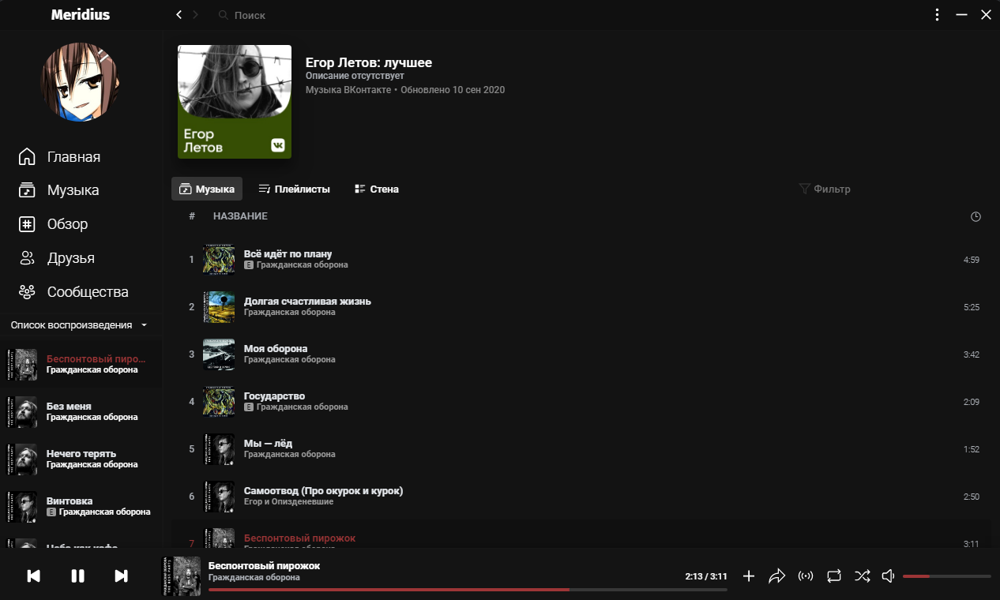
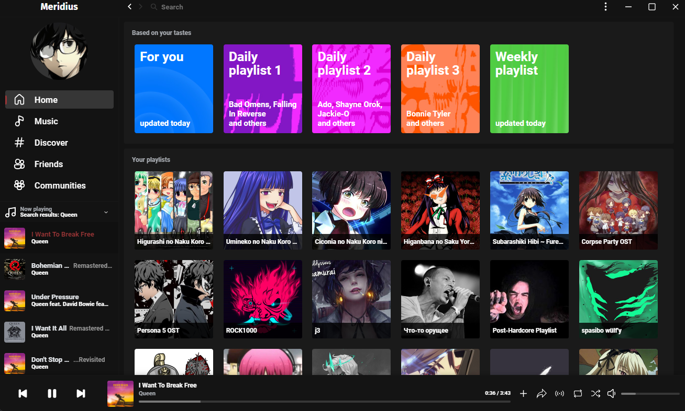
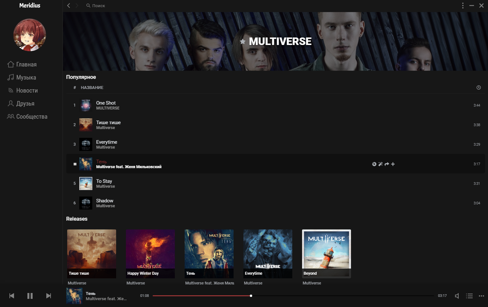

    
    <h1 align="center">Meridius</h1>
    
Meridius — это абсолютно бесплатное приложение для прослушивания музыки в социальной сети VK.
Приложение предлагает широкий функционал, схожий с функционалом самой социальной сети и множество уникальных функций и особенностей.

    <table align="center">
        <tr>
            <td><h4><a href="https://purplehorrorrus.github.io/meridius/">Windows</a></h3></td>
            <td><h4><a href="https://flathub.org/apps/details/io.github.purplehorrorrus.Meridius">Linux</a></h4></td>
        </tr>
    </table>

Никаких подвохов — Meridius абсолютно бесплатный, без рекламы и каких-либо коммерческих целей!  
Meridius был создан таким же любителем музыки, как и вы.

## 💡 Особенности

* Слушайте музыку совершенно бесплатно и без рекламы  
* Поиск музыки и плейлистов
* Поиск и информация об исполнителях, благодаря интеграции с LastFM и Deezer
* Приятный современный интерфейс
* Низкое потребление системных ресурсов
* Выбор цветовой схемы
* Нормализация громкости трека
* Встроенный эквалайзер
* Миниплеер с двумя режимами отображения
* Скачивание треков и целых плейлистов
* Импорт аудио и плейлистов из YouTube
* Добавляйте в избранное пользователей, группы и исполнителей для быстрого доступа
* Слушайте музыку ваших друзей и сообществ
* Управляйте своими плейлистами
* Если вы стример - вывод название песни в OBS Studio или XSplit Broadcaster на трансляцию
* Делитесь треками и плейлистами с друзьями
* Подключайте свои приложения к Meridius, используя встроенный сервер
* И многое другое!

## 📃 Пользовательское соглашение

Перед началом использования Meridius ознакомьтесь с пользовательским соглашением.

Meridius - проприетарное программное обеспечение, не преследующее коммерческих целей и распространяющееся бесплатно. Meridius является неофициальным настольным музыкальным плеером для сайта ВКонтакте, приложение и его разработчик не имеют никакого отношения к администрации и прочим сотрудникам компании VK.

### Сбор и хранение данных

Meridius собирает статистику только о количестве пользователей. Ваши учётные данные никуда не отправляются, только сохраняются на вашем устройстве в зашифрованном виде.

### Отказ от ответственности

Разработчик не несёт ответственности за потерю ваших персональных данных в случае утечек или взлома.

## 💻 Системные требования

**OS**: Windows 7 или выше, современный Linux с поддержкой среды рабочего стола (GNOME, KDE) 
**RAM**: 512 MB 

## ❓ FAQ

Найти ответы на интересующие вас вопросы касаемо плеера или задать свои можно [здесь](https://vk.com/topic-189978708_41319320)

Если у вас возникла проблема с приложением, поищите решение [здесь](./troubleshooting.md) или создайте тикет

## 💬 Контакты

[Группа VK](https://vk.com/meridius_player)  
[Страница VK](https://vk.com/id529592613)  
[Discord](https://discord.gg/R6gKtbnEVj)  
[Twitch](https://twitch.tv/infinitehorror)

## 🖤 Огромное спасибо

[EasyVK (Kirill Novak)](https://ciricc.github.io/) за модуль EasyVK!

## 💲 Поддержка

Если есть желание, вы можете [поддержать](https://donatepay.ru/don/InfiniteHorror) разработку