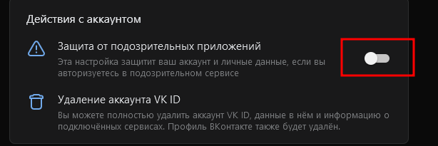
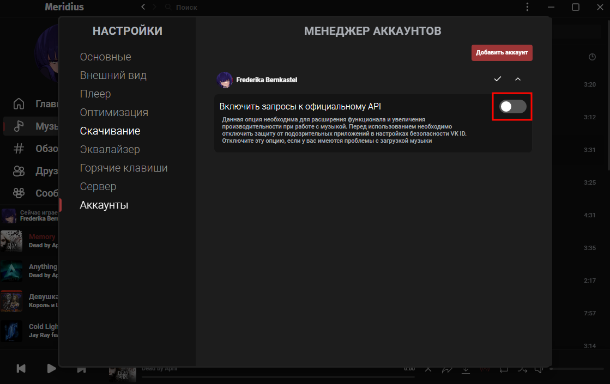

# Возможные проблемы и их решение

## Папка конфигурации

Специальная папка, которая создаётся в файловой системе для хранения данных и настроек.

> Windows: %appdata%/meridiusreborn/config

> Linux: /home/\<user>/.config/meridiusreborn/config
> > Flathub: /home/\<user>/.var/app/io.github.purplehorrorrus.Meridius/config/meridiusreborn/config

## Проблемы с авторизацией, не загружаются плейлисты или другие страницы после авторизации

Такая проблема встречается при включенной защите от подозрительных приложений. Чтобы отключить эту защиту, вам потребуется перейти в раздел [Безопасность и вход](https://id.vk.com/account/#/security) в настройках VK ID и отключить соответствующий пункт, после чего очистить папку конфигурации и переавторизоваться в приложение, либо отключить запросы к официальному API в настройках аккаунта в приложении.
### Отключить защиту от подозрительных приложений

После отключения защиты убедитесь, что у вас включены запросы к официальному API в приложении.

### Отключить запросы к официальному API
Если вы не хотите отключать защиту, но не против пожертвовать некоторым функционалом, то обязательно отключите опцию в приложении, указанную на скриншоте.

